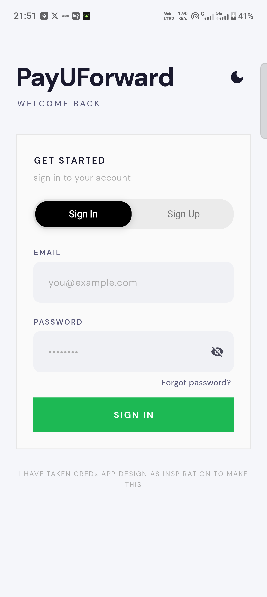
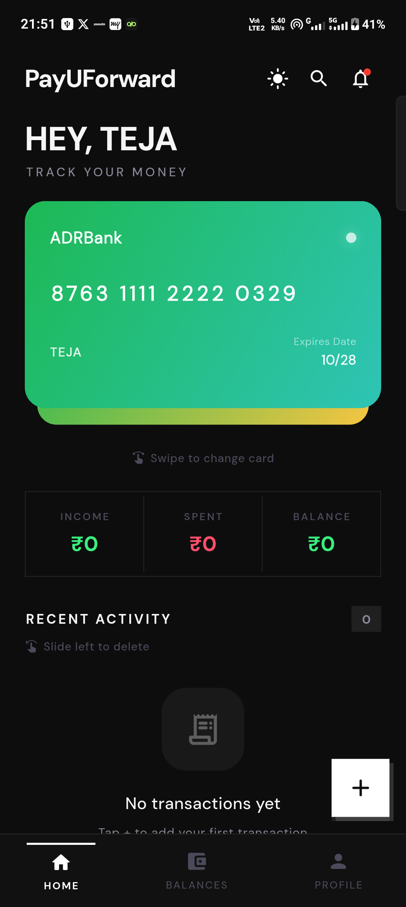
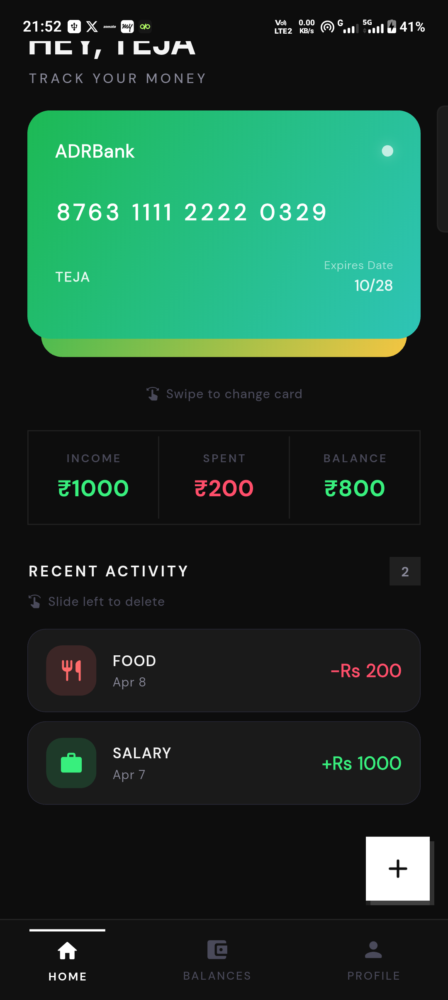
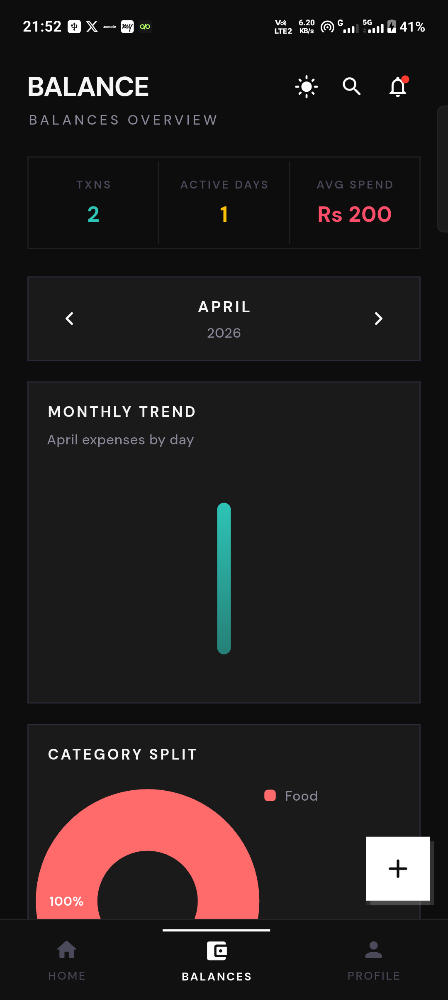
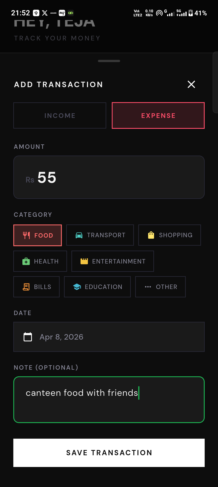

# Expense Tracker (TakeUForward Assignment)

Thank you for reviewing this assignment submission. This README includes architecture choices, state management decisions, scalability notes, setup steps, screenshots, and demo links.

A Flutter-based personal finance tracker with a modern fintech-style UI, local persistence, and modular architecture for future backend migration.

## Demo Video

<video src="Demo_Vedio.mp4" controls width="900"></video>

WATCH DEMO VEDIO OF THE APP HERE here: [Watch Demo Video](Demo_Vedio.mp4)

## Table of Contents

- [Architecture Decisions and Assumptions](#architecture-decisions-and-assumptions)
	- [Why This Architecture](#why-this-architecture)
  - [State Management Choice: Riverpod](#state-management-choice-riverpod)
	- [Repository Pattern + Hive](#repository-pattern--hive)
	- [Scalability and Backend Migration Readiness](#scalability-and-backend-migration-readiness)
	- [Key Assumptions](#key-assumptions)
- [Setup Instructions](#setup-instructions)
- [Feature List](#feature-list)
- [App Screenshots](#app-screenshots)
- [UI/UX Inspiration](#uiux-inspiration)
- [AI Disclosure](#ai-disclosure)

## Architecture Decisions and Assumptions

### Why This Architecture

I used a modular, feature-first structure with clear responsibilities:

- `screens/` for UI views
- `controller` for presentation/business logic and state coordination
- `repository` for data access abstraction
- `services/` for low-level integrations (Hive, theme settings)

This follows an MVC-like flow adapted for Flutter + Riverpod:

- View: screen/widget layer
- Controller: Riverpod notifiers/providers as app logic
- Model: domain models (`TransactionModel`, `AppUser`, etc.)
- Repository: data boundary between controller and persistence

### State Management Choice: Riverpod

I chose Riverpod as the primary state management approach for this assignment.

Why Riverpod fits this project:

- Compile-time safety
  - Provider wiring and type mismatches are caught early, reducing runtime state bugs.
- Testability
  - Controllers and providers are easy to unit test in isolation.
  - Business logic can be validated without rendering full widget trees.
- Scalability
  - Feature-level providers keep state localized and maintainable.
  - As the app grows, each module can evolve independently with cleaner boundaries.
- Cleaner code
  - Less boilerplate for dependency access compared to manual wiring.
  - Clear, predictable flow from UI -> controller -> repository.

### Repository Pattern + Hive

Current persistence is local using Hive for fast offline storage and simple setup.

- `HiveService` handles actual read/write operations
- Repositories wrap `HiveService` and expose app-friendly methods
- Controllers call repositories, not Hive directly

This keeps the app logic independent from the storage implementation.

### Scalability and Backend Migration Readiness

Because UI and controllers do not depend directly on Hive APIs, backend migration is straightforward:

1. Replace or extend repository implementations to call REST/GraphQL/Firebase.
2. Keep screen and controller contracts mostly unchanged.
3. Optionally add sync/caching strategy while preserving local-first UX.

In short, the current architecture is clean, testable, and scalable for future growth.

### Key Assumptions

- This is an assignment scope app, so authentication is simplified for local flow.
- Local-first behavior is preferred for speed and demo reliability.
- Feature boundaries are intentionally kept separate to avoid tightly coupled code.

## Setup Instructions

### Prerequisites
- Flutter SDK (recommended stable channel)
- Dart SDK (comes with Flutter)
- Android Studio or VS Code with Flutter extension
- Android emulator / iOS simulator / physical device

### 1) Clone and open project
```bash
git clone https://github.com/Teja-Varshith/Expense_Tracker_TUFAssignment.git
cd expense_tracker_tuf
```

### 2) Install dependencies
```bash
flutter pub get
```

### 3) Run the app
```bash
flutter run
```

### 4) Build release (optional)
```bash
flutter build apk
```

## Feature List

- Authentication flow
  - Sign in
  - Sign up
  - User session via local storage
- Home dashboard
  - Monthly income, expense, and balance summary
  - Recent transactions list
  - Swipe-to-delete with confirmation dialog
- Add transaction flow
  - Income/Expense type toggle
  - Category selection
  - Custom category support
  - Date and note support
- Balance analytics
  - Monthly trend chart
  - Category breakdown pie chart
  - Insight cards (net status, top expense)
- Profile module
  - View profile details and stats
  - Update details
  - Sign out
- Theming
  - Light/dark theme toggle available in top app bars
- Notification UX
  - Awesome snackbar feedback (`awesome_snackbar_content`) for key success/error/warning events

## App Screenshots

All screenshots are stored in `docs/screenshots/`.

<table>
  <tr>
    <td></td>
    <td></td>
    <td></td>
    <td></td>
  </tr>
  <tr>
    <td></td>
    <td></td>
    <td></td>
    <td></td>
  </tr>
</table>

## UI/UX Inspiration

Since this is a fintech app assignment, I took inspiration from the CRED app's visual language and interaction style, and designed the UI/UX in a similar modern fintech direction.

## AI Disclosure

AI assistance was used in parts of this project, including:

- color/theming exploration and refinements
- reducing repetitive/boilerplate tasks
- helping reason through architecture and feature breakdown

All final code and decisions were reviewed and integrated intentionally for this project.
